# Retro Classics

Retro Classics is built using a combination of HTML, CSS, JavaScript, Python, and Django. I have incorporated Cloudinary for efficient image management and Stripe for secure and convenient payment processing.

## Contents

* [User Experience](#user-experience)

  * [User Stories](#user-stories)

  * [Initial Discussion](#initial-discussion)

  * [Agile Methodology](#agile-methodology)

* [Design](#design)

  * [Colour Scheme](#colour-scheme)

  * [typograpghy](#typograpghy)

  * [Wireframes](#wireframes)

* [Features](#features)

  * [Existing Features](#existing-features)

  * [Future Features](#future-features)

* [Testing](#testing)

* [Technologies Used](#technologies-used)

* [Deployment](#deployment)
  
  * [ElephantSQL](#elephantsql-database-setup)

  * [Heroku](#heroku)

  * [Local Deployment](#local-deployment)

## User Experience

### User stories

* **Iteration 1**

  * **Epic Pre-Developement.**

    * **USER STORY:** *Wireframes*.

      * As a **developer**, I want to **create wireframes** to **visualize the layout and features of the eCommerce store.**

    * **USER STORY**: *Frameworks and Libraries*.

      * As a **developer**, I want to **decide on the frameworks and libraries** that will be **most beneficial for my project.**

    * **USER STORY:** *Set up Django.*

      * As a **developer**, I want to **initialize the Django project** to lay the **foundation for my eCommerce store.**

  * **USER STORY:** *User Authentication.*

    * As a **developer**, I want to **implement user authentication** so that **users can have personalized experiences**.

  * **USER STORY:** *Basic Navigation.*

    * As a **developer**, I want to **implement basic navigation features** to facilitate user flow **through the eCommerce store**.

  * **USER STORY:** *Homepage Design.*

    * As a **developer**, I want to **design a compelling homepage** to provide users with an **overview of what the eCommerce store offers.**

  * **USER STORY:** *Background image.*

    * As a **developer**, I want to **set an engaging background image for the homepage** to create an **retro feel to the shop**.

* **Iteration 2**

  * **USER STORY:** *Basic Product Management.*

    * As a **developer**, I want to create a **simple product management system** so that products can be **added, viewed, and categorized in the eCommerce store.**

  * **USER STORY:** *Products.*

    * As a **developer**, I want to make it **easy to add, view, and organize products**

  * **USER STORY:** *Shopping cart.*

    * As a **developer**, I want to implement a **functional shopping cart** and add **styling for a user-friendly appearance.**

  * **USER STORY:** *Static And Media Files.*

    * As a **developer**, I want to **manage static and media files** effectively to ensure **quick page loads and optimized performance**.

### Agile Methodology

This project was developed using **Agile methodologies** to facilitate flexibility and iterative progress. Embracing an adaptive planning process allowed me to continuously improve and respond to evolving project needs.

### User Stories and MOSCOW Prioritization

To outline project features, I defined user stories short descriptions from an end user's perspective. Employing the MOSCOW technique helped me prioritize these features effectively:

* **Must-Have:** Identified critical features essential for project success.
* **Should-Have:** Important features that were not immediately critical.
* **Could-Have:** Considered features that could be included if time allowed.
* **Wont-Have:** Acknowledged nice-to-haves that were intentionally excluded from the current scope.

MOSCOW prioritization guided me in managing expectations, focusing on key deliverables, and navigating the development process.

### Kanban Board for Task Management

I utilized a Kanban board to visually manage the flow of work throughout the project. The board's columns included:

* **To Do:** Tasks (user stories) planned for development.
* **In Progress:** Tasks actively being worked on.
* **Done** Tasks that have been finished.
* **Future Features:** Tasks that will be added in the future.
* **Wont Have** Tasks that wont be included in the project.

This Kanban board provided a clear visual representation of my project's progress, making it easier to track and manage tasks.
[Link to project Kanban board.](https://github.com/users/DylanP400/projects/8)


[Back to top](#retro-classics)


### Initial Discussion

## Design

### Colour Scheme

### Typograpghy

### Wireframes

<details>
<summary>Desktop Wireframes</summary>

<details>
<summary>Home Page</summary>

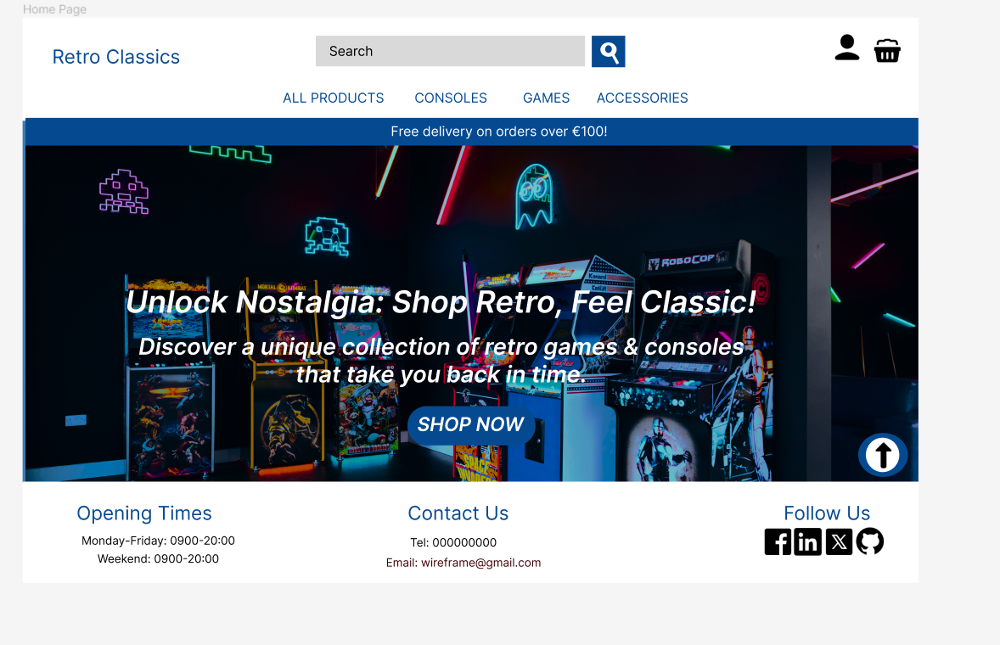
</details>

<details>
<summary>All Products</summary>

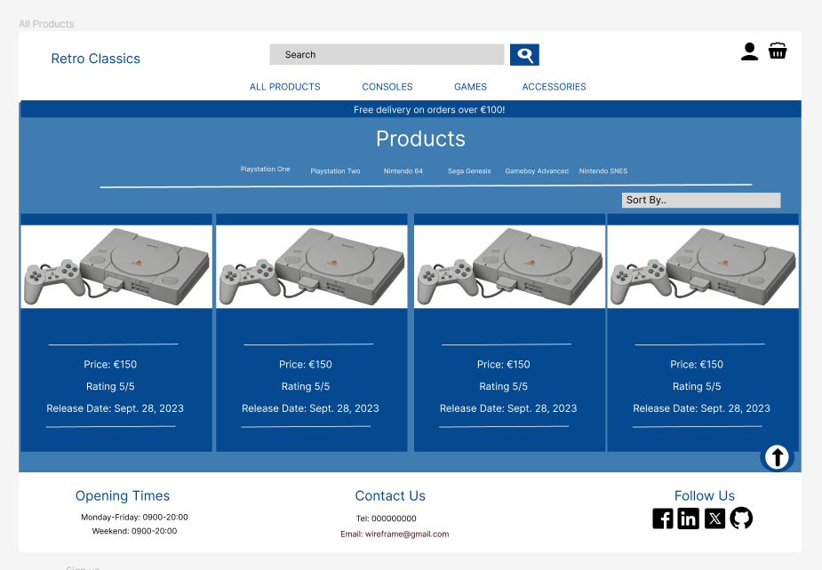
</details>

<details>
<summary>Product Detail</summary>


</details>

<details>
<summary>Profile</summary>

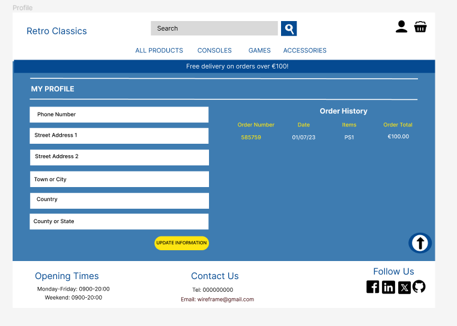
</details>

<details>
<summary>Sign Up</summary>

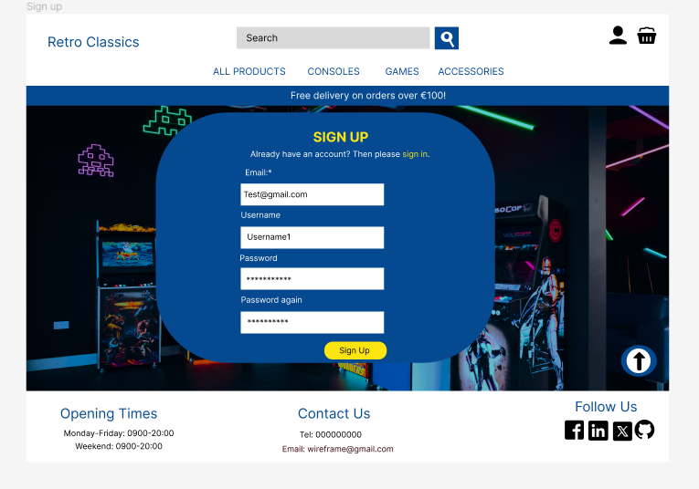
</details>

<details>
<summary>Sign In</summary>

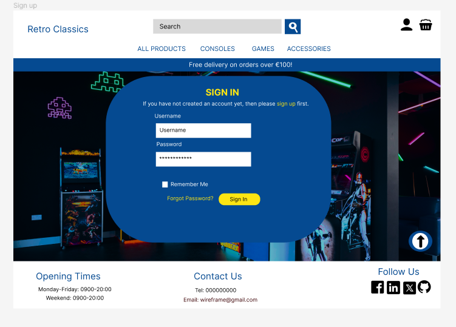
</details>
</details>

## Features

### Existing Features

### Header and Nav Bar

The Retro Classics Store features a logo. At the top of the page, users can easily navigate through the store with a search bar. The account icon provides access for signing in or creating a new account. The basket icon allows users to view the contents of their shopping basket, with the total displayed underneath. The navigation bar categorizes the store into "All Products," "Consoles," "Games," and "Accessories,". Plus, a noticeable free delivery banner in the header treats users to free shipping on orders over €100.
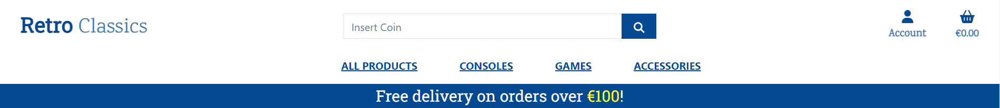

* **All Products**.

  * On Sale!

  * By Price.

  * By Rating.

  * By Players.

  * All Products.

* **Consoles.**

  * Playstation.
    * Playstation One.
    * Playstation Two.

  * Nintendo.
    * Nintendo SNES.
    * Nintendo 64.

  * Sega
    * Sega Genesis.

  * Handheld
    * Gameboy Advanced.
    * Playstation Portable.

  * Emulation
    * Raspberry Pi 4.

  * All Consoles.
  
* **Games.**

  * Playstation One.

  * Playstation Two.

  * Nintendo SNES.

  * Nintendo 64.

  * Sega Genesis.

  * Gameboy Advanced.

  * Playstation Portable.

  * Raspberry Pi 4.

  * All Games.

* **Accessories.**

  * Controllers.

  * Memory Cards.

  * Cables & Adapters.

  * All Accessories.

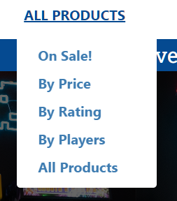
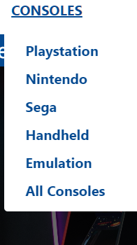

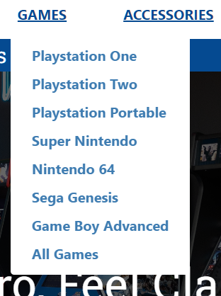
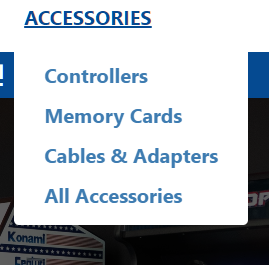

* **Free delivery banner for orders over €100.**

## Footer

* The footer has four main section.

  * Newsletter for signing up.

  * Opening Times.

  * Contact us with phone number and email address for the store.

  * Follow us with four social media icons for Facebook, Twitter, Linkedin and Github.

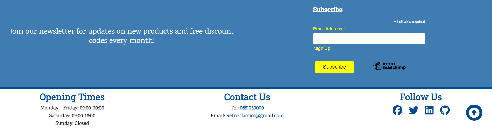

## Home Page

The home page of the Retro Classics Store welcomes visitors with a callout inviting users to "Unlock Nostalgia: Shop Retro, Feel Classic! Discover a unique collection of retro games & consoles that take you back in time." and a background image featuring six arcade machines. The inviting message sets the nostalgic tone for the shopping experience. A "Shop Now" button encourages users to explore the products of the store. As users scroll down, they encounter a header announcing the ongoing sale. The "Check Out Our Sale" section showcases four highlighted products. Continue scrolling users are greeted by another header titled "Testimonials." This section has two testimonials from customers who share their positive experiences with the Retro Classics Store.
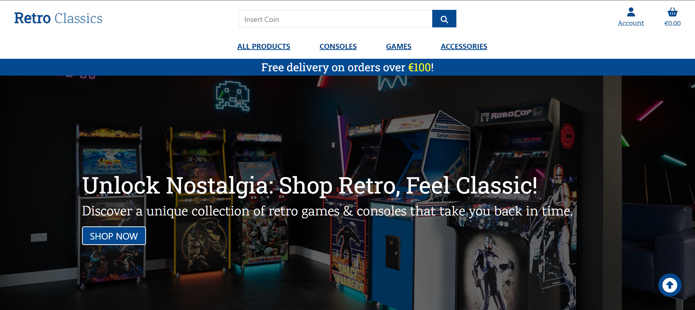

### Products on sale

* Heading saying "Check out our sale"
* Four products are displayed on the home page with the photos, names, descriptions and prices with a button to view to product underneath

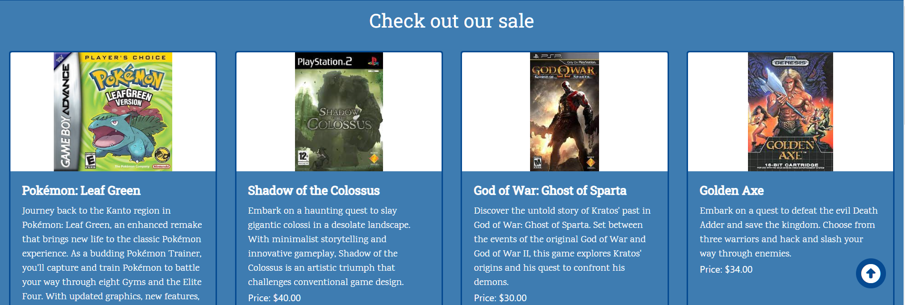
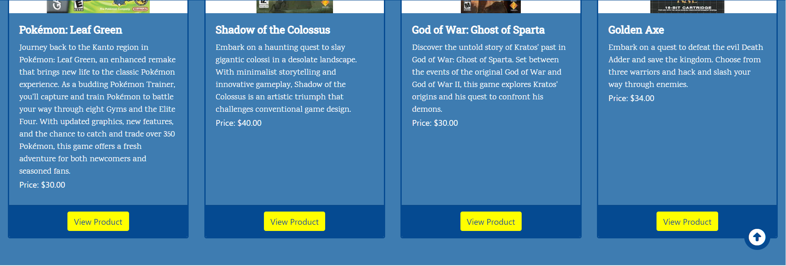

### Testimonials

* The testimonial section just has two reviews left by customers.

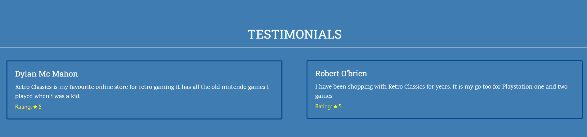

## All Products

The All Products page features a clean layout with a small heading on the left indicating the total number of products available. A sorting box on the right allows users to arrange products based on various criteria. Product cards are displayed in rows, each showcasing an image, product name, price, rating, and release date. Clicking on the image leads to the detailed product page, while a link on each card invites users to explore more products in the selected category. If you are a superuser there is two buttons for editing and deleting the product
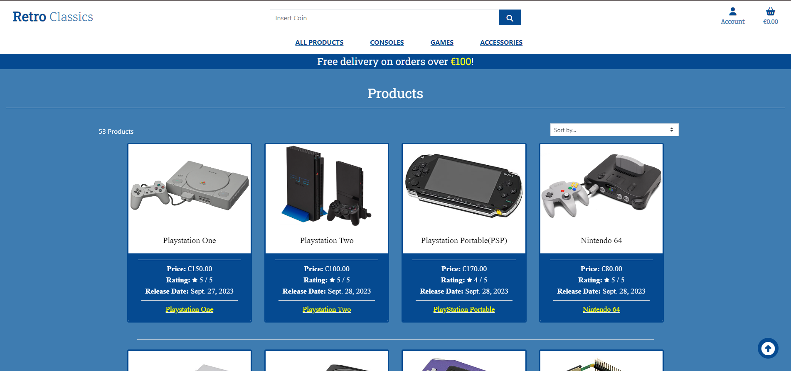

## Product Detail

The product detail page features a product image, name, and price. A description along with details like rating, players, release date, color, and manufacturer and storage. Additional information includes storage options and memory card compatibility. Below, there's a user-friendly quantity selection box with plus and minus buttons and an "Add to Basket" button. Towards the bottom, two buttons allow users to explore more products or quickly browse products in the same category. If you are a superuser there is 2 buttons for editing and deleting the product
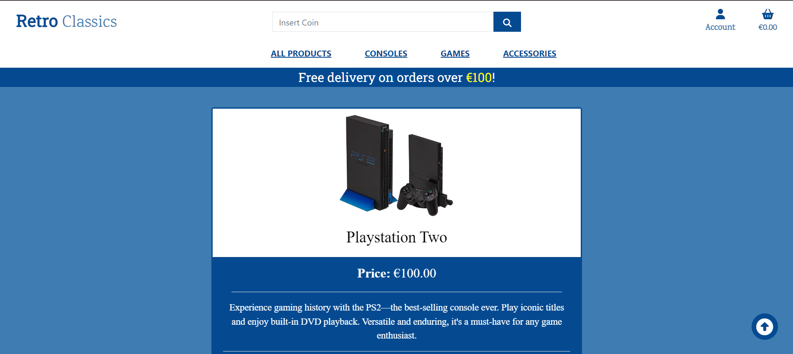
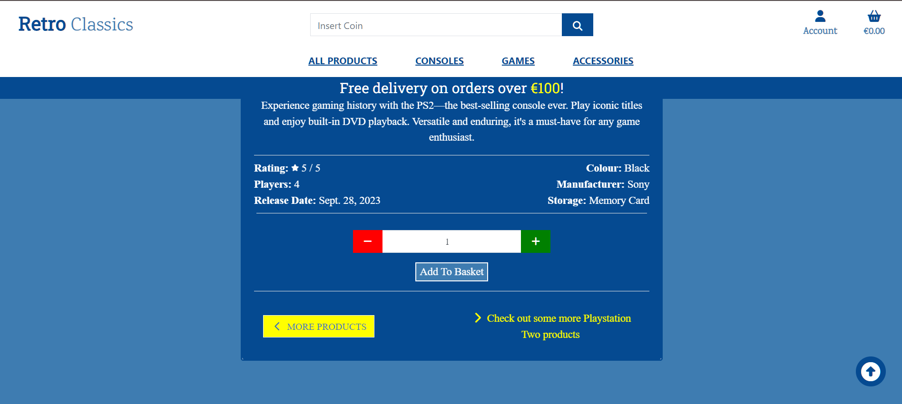

## Product Management

The product management page provides a simple form for adding new products. The form includes fields for Category, Name, SKU, Image, Description, Rating, Price, Players, and an option to mark the product as On Sale. Users can easily fill in these details. Two buttons are available for action: "Add Product" to save the information, and "Cancel" to discard changes if needed.
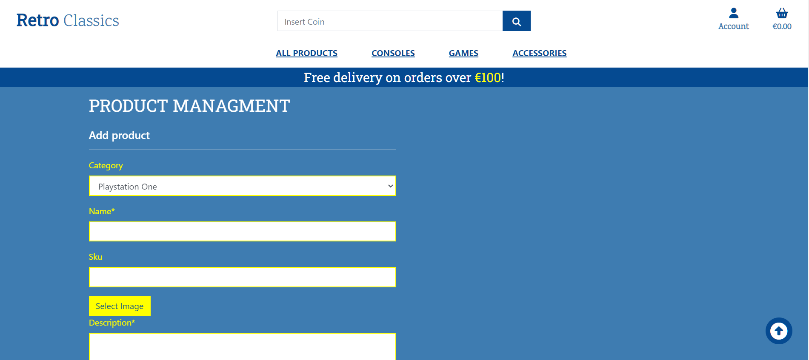
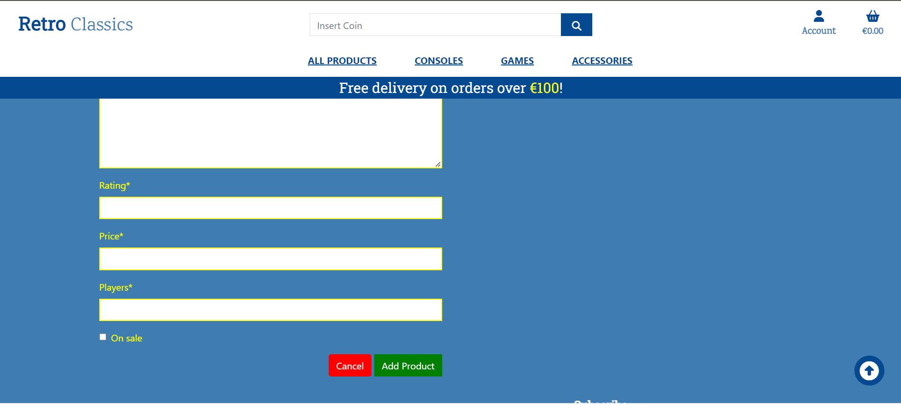

## Profile

The user profile page features an H1 title "Profile" serving as the main heading. The layout is divided into two sections for user convenience.
On the left, users can easily update their information, including details like phone number and delivery address. A button labeled "Update Information" makes it easy to modify your details. On the right, a separate section displays the user's previous order history, providing a quick overview of past purchases.


## Shopping Basket

If the user has no items in the shopping basket, the page will be empty with a paragraph saying, "Sorry, you have no items in your basket." and a link to Browse Products.
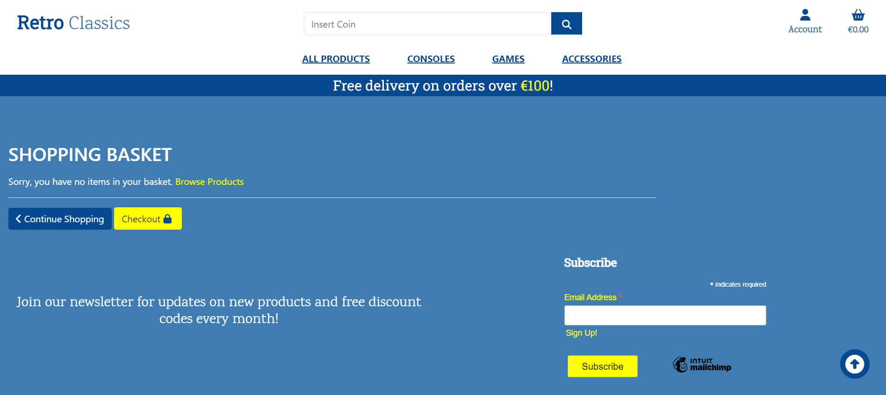
The Shopping Basket page starts with a heading, "Shopping Basket." The table showcases product details: name, SKU, image, quantity, and price. On the right, you'll find a section labeled "Have a Coupon?" with an Apply button that is currently inactive. Below, a summary box highlights the total price, delivery cost, and grand total. Two buttons at the bottom ease navigation - "Continue Shopping" for more products and "Checkout" for the payment process.
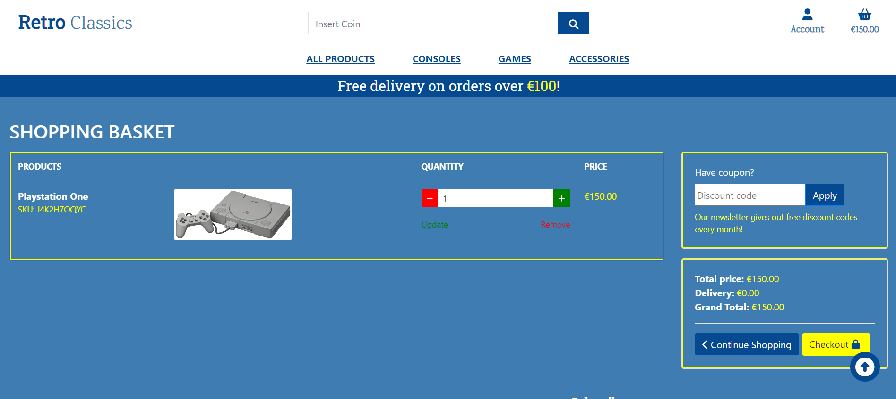

## Checkout

## Register

The Register page presents a simple form for users to create an account. The form includes fields for email, username, and password.
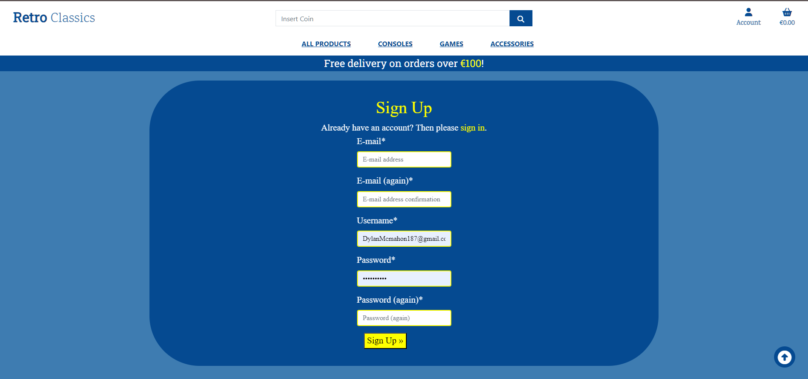

## Sign In

The Register page presents a simple form for users to sign up. The form includes fields for username, and password.


## Sign Out

The Sign Out page presents a paragrapgh asking users "Are you sure you want to sign out?" with a button for logging out.
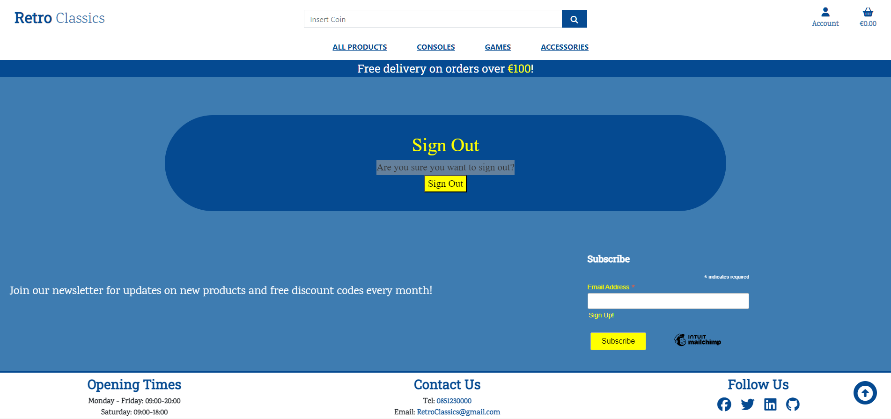

## Password Reset

The Password Reset page presents a paragrapgh asking users "Forgotten your password? Enter your e-mail address below, and we'll send you an e-mail allowing you to reset it." with a button for resetting your password.
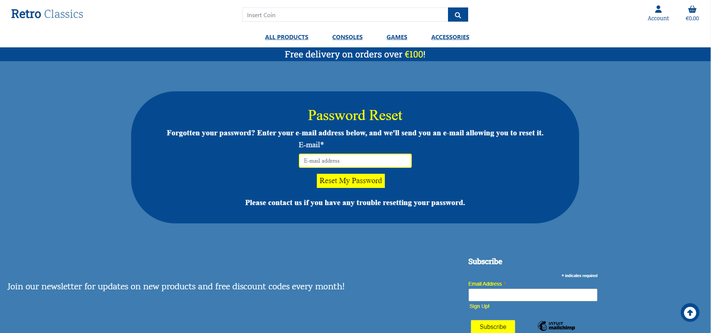

### Future Features

## Testing

## Technologies Used

## Deployment

### ElephantSQL Database Setup

**Step 1: Obtain ElephantSQL Database URL**

1. **Sign up or sign in to ElephantSQL:**

   * *If you don't have an account, sign up otherwise, log in to your account.*

2. **Create a new ElephantSQL instance:**

   * *From the dashboard, click on `Create New Instance`.*

   * *Choose a plan based on your requirements.*

3. **Retrieve your ElephantSQL Database URL:**

   * *Once the instance is created, click on it to view details.*
   * *Find and copy the `URL` provided this is your `ElephantSQL Database URL`.*

### Step 2: Configure Django Project

1. **Add DATABASE_URL to env.py:**

   * *Open your `env.py` file.*

   * *Set `DATABASE_URL` to the value obtained from ElephantSQL.*

### Step 3: Use DATABASE_URL in Django Settings

1. **Update Django Settings:**

   * *Open your `settings.py` file in your Django project.

   * *Locate the `DATABASES` configuration.*

   * *Comment out the orignal django database settings*

   * *Update the `DATABASES` setting to use the `dj_database_url` package:*

     ```python
     import dj_database_url
     # At the top of settings.py with the other imports

     DATABASES = {
     'default': dj_database_url.parse(os.environ.get("DATABASE_URL"))
      }
      # Replace the orignal database with what is above

     ```

   * *This allows your Django project to use the ElephantSQL Database URL.*

2. **Migrate Database Changes:**

   * *Run the following commands in your terminal:*

     ```bash
     python manage.py makemigrations
     python manage.py migrate
     ```

   * *This ensures that your database is updated with the latest changes.*

* **Note: Upcoming Changes to ElephantSQL Free Tier**
  
  * *ElephantSQL is making changes to its free tier in the next few months. If you're using or planning to use the free tier, be prepared for some tweaks in the deployment process.
  As of now, the steps in this guide are based on the current ElephantSQL setup. ElephantSQL will have updates regarding these changes check their official announcements and documentation for the latest info. If you run into any deployment problems or notice any differences refer to the updated ElephantSQL docs.*

## Heroku

### Step 1: Prepare Environment Variables

*Create an `env.py` file at the root level of your project. Copy and paste the following content into the file:*

```python
import os

# Replace placeholders with your actual values
os.environ['DATABASE_URL'] = 'Your_ElephantSQL_Database_url'
os.environ['SECRET_KEY'] = 'Your_Django_secret_key'
os.environ['CLOUDINARY_URL'] = 'Your_Cloudinary_url'
```

## Step 2: Heroku App Setup

1. **Sign up or sign in to your Heroku account:**
   * *If you don't have an account, sign up otherwise, log in to your account.*

2. **Create a new app from the Heroku dashboard:**
   * *Choose a name for your app.*
   * *Select the region that is most suitable for you.*

3. **Configure app settings:**
   * *In the app's settings, find and click on 'Reveal Config Vars'.*
   * *Add the following variables with their corresponding values:*
     * `DATABASE_URL`: *Your ElephantSQL Database URL.*
     * `SECRET_KEY`: *Your chosen Django secret key.*
     * `CLOUDINARY_URL`: *Your Cloudinary URL.*
     * `DISABLE_COLLECTSTATIC`: *Set to `1` for initial deployment.*
     * `PORT`: *Set to* `8000`

## Step 3: Deployment from GitHub

1. **Choose the Deploy option:**
   * *Go to the Deploy tab in your app dashboard.*

2. **Connect to GitHub:**
   * *Under Deployment method, choose Connect to GitHub.*

3. **Select your GitHub repository:**
   * *Find your GitHub repository by name and connect.*

4. **Choose deployment method:**
   * *At the bottom of the page, choose either Automatic Deployment or Manual Deployment (deploy by branch).*

5. **Initiate deployment:**
   * *Click on the option you prefer, and the deployment process should begin.*

6. **Monitor deployment progress:**
   * *After a while, your app should be deployed. You can check the progress in the Heroku dashboard.*


## Local Deployment

### How to Fork

**To fork the repository:**

1. *Log in to **Github.***
2. *Go to the **repository** for this project, [DylanP400/RetroClassics](https://github.com/DylanP400/RetroClassics)*
3. *Click the **Fork button** in the top right corner.*

### How to clone

**To clone the repository**

1. *Log in to **GitHub.***
2. *Go to the **repository** for this project, [DylanP400/RetroClassics](https://github.com/DylanP400/RetroClassics)*
3. *Click on the **code button**, select whether you would like to clone with **HTTPS**, **SSH** or **GitHub CLI** and copy the link shown.*
4. *Open the **terminal** in your **code editor** and change the current **working directory** to the location you want to use for the **cloned directory.***
5. *Type **'git clone'** into the **terminal** and then **paste** the link you copied in step 3. **Press enter**.*


<!-- # Imagery 
https://pixabay.com/images/search/retro%20gaming/?pagi=2
https://www.pexels.com/search/video%20game/
https://www.rawpixel.com/search/Retro%20gaming?page=1&sort=curated&topic_group=_topics -->
