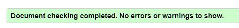
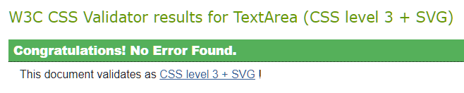
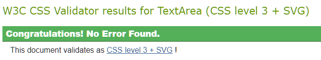

* [validation](#validation)
    * [HTML Validation](#html-validation)
    * [CSS Validation](#css-validation)

# Validation

## HTML Validation

For testing the **HTML** files I used [W3C Validator](https://validator.w3.org/).

Home

* 

All Products

* 

Product Detail

* 

Add Product

* ![Add Product] Needs updating

Edit Product

* ![Edit Products] Needs updating

Bag

* ![Bag] Update 

Checkout

* 

Checkout Success

* 

Register

* 

Login page

* 

Logout page

* 

Profile page

* 

## CSS Validation

For testing the **CSS** files I used [W3C Jigsaw](https://jigsaw.w3.org/css-validator/)

base.css

* 

checkout.css

* 

profile.css

* 

