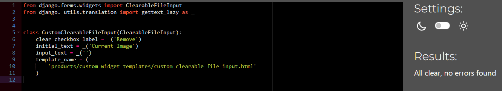

# Testing

* [Manual Testing](#manual-testing)

* [validation](#validation)

  * [HTML](#html-validation)

  * [CSS](#css-validation)

  * [Python](#python-validation)

  * [Javascript](#javascript-validation)

* [Lighthouse](#lighthouse)

## Manual Testing

### Header

| Feature | User Action | Expected Result | Desktop Pass/Fail | Mobile Pass/Fail
| :---| :---| :---| :---| :---|
| Logo | Clicking on the Retro Classics Logo | Redirects to the Home page | Pass | Pass |
| Search Box | Clicking into the search box | Allows the user to type their search query and search the store. | Pass | Pass |
| Search Box Button | Clicking the search button | Navigates to the user to their search query | Pass | Pass |
| Account Icon | Clicking the Acount Icon | Reveals a dropdown menu in the header with additional links. | Pass | Pass |
| Account Icon > Register Link  | Clicking the Register Link | Navigates to the Register page | Pass | Pass |
| Account Icon > Login Link  | Clicking the Login Link | Navigates to the Login page | Pass | Pass |
| Account Icon > Product Management Link  | Clicking the Product Management Link | Navigates to the Product Management page | Pass | Pass |
| Account Icon > Profile Link  | Clicking the Profile Link | Navigates to the Profile page | Pass | Pass |
| Account Icon > Logout  | Clicking the Logout Link | Navigates to the Logout page | Pass | Pass |
| Basket Icon | Clicking the Basket Icon | Navigates to the users basket | Pass | Pass |
| Basket Icon  | When a user adds a product to their basket | Displays the users basket total | Pass | Pass |

### Navbar

| Feature | User Action | Expected Result | Desktop Pass/Fail | Mobile Pass/Fail
| :---| :---| :---| :---| :---|
| All Products Link | Clicking on the All Products link | Reveals a dropdown menu in the navigation bar with additional links. | Pass | Pass |
| All Products > On Sale! Link | Clicking on the On Sale! link | Navigates to the products on sale | Pass | Pass |
| All Products > By Price Link | Clicking on the By Price link | Sorts all products by lowest price | Pass | Pass |
| All Products > By Rating Link | Clicking on the By Rating link | Sorts all products by highest rating | Pass | Pass |
| All Products > By Players Link | Clicking on the By Players link | Sorts all products by lowest amount of players | Pass | Pass |
| All Products > All Products Link | Clicking on the All Products link | Navigates to all products | Pass | Pass |
| Consoles Link | Clicking on the Consoles link | Reveals a dropdown menu in the navigation bar with additional links for consoles | Pass | Pass |
| Consoles > Playstation Link | Clicking on the Playstation link | Reveals a dropdown menu in the navigation bar with additional links for Playstation products. | Pass | Pass |
| Consoles > Playstation > Playstation One Link | Clicking on the Playstation One link | Navigates to the Playstation One Console products. | Pass | Pass |
| Consoles > Playstation > Playstation Two Link | Clicking on the Playstation Two link | Navigates to the Playstation Two Console products. | Pass | Pass |
| Consoles > Nintendo Link | Clicking on the Nintendo link | Reveals a dropdown menu in the navigation bar with additional links for Nintendo products. | Pass | Pass |
| Consoles > Ninendo > Super Nintendo Link | Clicking on the Super Nintendo link | Navigates to the Super Nintendo Console products. | Pass | Pass |
| Consoles > Ninendo > Nintendo 64 Link | Clicking on the Nintendo 64 link | Navigates to the Nintendo 64 Console products. | Pass | Pass |
| Consoles > Sega Link | Clicking on the Sega link | Reveals a dropdown menu in the navigation bar with additional links for Sega products. | Pass | Pass |
| Consoles > Playstation > Sega Genesis Link | Clicking on the Sega Genesis link | Navigates to the Sega Genesis Console products. | Pass | Pass |
| Consoles > HandHeld Link | Clicking on the HandHeld link | Reveals a dropdown menu in the navigation bar with additional links for handheld products. | Pass | Pass |
| Consoles > Handheld > Playstation Portable Link | Clicking on the Playstation Portable link | Navigates to the Playstation Portable Console products. | Pass | Pass |
| Consoles > Handheld > Gameboy Advanced Link | Clicking on the Gameboy Advanced link | Navigates to the Gameboy Advanced Console products. | Pass | Pass |
| Consoles > Emulation Link | Clicking on the Emulation link | Reveals a dropdown menu in the navigation bar with additional links for emualtion propducts. | Pass | Pass |
| Consoles > Emulation > Raspberry Pi 4 Link | Clicking on the Raspberry Pi 4 link | Navigates to the Raspberry Pi 4 products. | Pass | Pass |
| Consoles > All Consoles Link | Clicking on the  All Consoles link | Navigates to the all products page | Pass | Pass |
| Games Link | Clicking on the Games link | Reveals a dropdown menu in the navigation bar with additional links for games | Pass | Pass |
| Games > Playstation One Link | Clicking on the Playstation One link | Navigates to the Playstation One products page | Pass | Pass |
| Games > Playstation Two Link | Clicking on the Playstation Two link | Navigates to the Playstation Two products page | Pass | Pass |
| Games > Playstation Portable Link | Clicking on the Playstation Portable link | Navigates to the Playstation Portable products page | Pass | Pass |
| Games > Super Nintendo Link | Clicking on the Super Nintendo link | Navigates to the Super Nintendo products page | Pass | Pass |
| Games > Nintendo 64 Link | Clicking on the Nintendo 64 link | Navigates to the Nintendo 64 products page | Pass | Pass |
| Games > Sega Genesis Link | Clicking on the Sega Genesis link | Navigates to the Sega Genesis products page | Pass | Pass |
| Games > Gameboy Advanced Link | Clicking on the Gameboy Advanced link | Navigates to the Gameboy Advanced products page | Pass | Pass |
| Games > All Games Link | Clicking on the All Games link | Navigates to the All Games products page | Pass | Pass |
| Accessories Link  | Clicking on the Accessories link | Reveals a dropdown menu in the navigation bar with additional links for Accessories | Pass | Pass |
| Accessories > Controller Link | Clicking on the Controller link | Navigates to the Controller products page | Pass | Pass |
| Accessories > Memory Cards Link | Clicking on the Memory Cards link | Navigates to the Memory Cards products page | Pass | Pass |
| Accessories > Cables & Adapters Link | Clicking on the Cables & Adapters link | Navigates to the Cables & Adapters products page | Pass | Pass |
| Accessories > All Accessories Link | Clicking on the All Accessories link | Navigates to the All Accessories products page | Pass | Pass |
| Free Delivery Banner | Free delivery for orders over €100 is displayed in the banner | | Pass | Pass |

## Validation

### HTML Validation

For testing the **HTML** files I used [W3C Validator](https://validator.w3.org/).

Home

* 

All Products

* 

Product Detail

* 

Add Product

* ![Add Product] Needs updating

Edit Product

* ![Edit Products] Needs updating

Bag

* ![Bag] Update 

Checkout

* 

Checkout Success

* 

Register

* 

Login page

* 

Logout page

* 

Profile page

* 

## CSS Validation

For testing the **CSS** files I used [W3C Jigsaw](https://jigsaw.w3.org/css-validator/)

base.css

* 

checkout.css

* 

profile.css

* 

## Python Validation

For testing the python files I used [Code Institutes CI Python Linter](https://pep8ci.herokuapp.com/)

### bag app

bag_tools.py

* 

apps.py

* 

urls.py

* 

views.py

* 

contexts.py

* 

### checkout app

admin.py

* 

apps.py

* 

forms.py

* 

models.py

* 

signals.py

* 

urls.py

* 

views.py

* 

webhook_handler.py

* 

webhooks.py

* 

### home app

apps.py

* 

urls.py

* 

views.py

* 

### products

apps.py

* 

admin.py

* 

forms.py

* 

models.py

* 

urls.py

* 

views.py

* 

widgets.py

* 

### profiles app

forms.py

* 

models.py

* 

forms.py

* 

### retro_classics app

asgi.py

* 

settings.py

* 

urls.py

* 

views.py

* 

### Custom_storages.py

* 

## Javascript Validation

checkout-stripe_elements.js

* 

main-nav.js

* 

profiles-country_field.js

* 

## Lighthouse

Home page

* Desktop

  * 

* Mobile

  * 

All Products

* Desktop

  * 

* Mobile

  * 

Product Detail

* Desktop

  * 

* Mobile

  * 

Add Product

* Desktop

  * 

* Mobile

  * 

Edit Product

* Desktop

  * 

* Mobile

  * 

Profile

* Desktop

  * 

* Mobile

  * 

Bag

* Desktop

  * 

* Mobile

  * 

Checkout

* Desktop

  * 

* Mobile

  * 

Checkout Success

* Desktop

  * 

* Mobile

  * 

Register

* Desktop

  * 

* Mobile

  * 

Sign In

* Desktop

  * 

* Mobile

  * 

Logout

* Desktop

  * 

* Mobile

  * 

Password Reset

* Desktop

  * 

* Mobile

  * 

