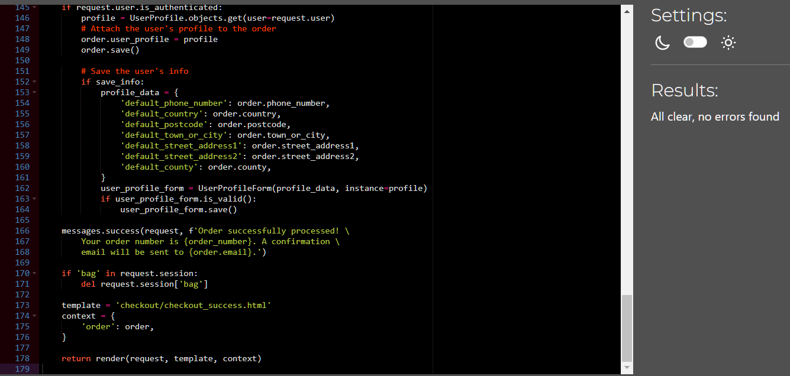

# Testing

* [Manual Testing](#manual-testing)

* [Validation](#validation)

  * [HTML](#html-validation)

  * [CSS](#css-validation)

  * [Python](#python-validation)

  * [Javascript](#javascript-validation)

* [Lighthouse](#lighthouse)

* [Responsiveness](#responsiveness)

## Manual Testing

### Header

| Feature | User Action | Expected Result | Desktop Pass/Fail | Mobile Pass/Fail
| :---| :---| :---| :---|
| Logo | Clicking on the Retro Classics Logo | Redirects to the Home page | Pass | Pass |
| Search Box | Clicking into the search box | Allows the user to type their search query and search the store. | Pass | Pass |
| Search Box Button | Clicking the search button | Navigates to the user to their search query | Pass | Pass |
| Account Icon | Clicking the Acount Icon | Reveals a dropdown menu in the header with additional links. | Pass | Pass |
| Account Icon > Register Link  | Clicking the Register Link | Navigates to the Register page | Pass | Pass |
| Account Icon > Login Link  | Clicking the Login Link | Navigates to the Login page | Pass | Pass |
| Account Icon > Product Management Link  | Clicking the Product Management Link | Navigates to the Product Management page | Pass | Pass |
| Account Icon > Profile Link  | Clicking the Profile Link | Navigates to the Profile page | Pass | Pass |
| Account Icon > Logout  | Clicking the Logout Link | Navigates to the Logout page | Pass | Pass |
| Basket Icon | Clicking the Basket Icon | Navigates to the users basket | Pass | Pass |
| Basket Icon  | When a user adds a product to their basket | Displays the users basket total | Pass | Pass |

### Navbar

| Feature | User Action | Expected Result | Desktop Pass/Fail | Mobile Pass/Fail
| :---| :---| :---| :---|
| All Products Link | Clicking on the All Products link | Reveals a dropdown menu in the navigation bar with additional links. | Pass | Pass |
| All Products > On Sale! Link | Clicking on the On Sale! link | Navigates to the products on sale | Pass | Pass |
| All Products > By Price Link | Clicking on the By Price link | Sorts all products by lowest price | Pass | Pass |
| All Products > By Rating Link | Clicking on the By Rating link | Sorts all products by highest rating | Pass | Pass |
| All Products > By Players Link | Clicking on the By Players link | Sorts all products by lowest amount of players | Pass | Pass |
| All Products > All Products Link | Clicking on the All Products link | Navigates to all products | Pass | Pass |
| Consoles Link | Clicking on the Consoles link | Reveals a dropdown menu in the navigation bar with additional links for consoles | Pass | Pass |
| Consoles > Playstation Link | Clicking on the Playstation link | Reveals a dropdown menu in the navigation bar with additional links for Playstation products. | Pass | Pass |
| Consoles > Playstation > Playstation One Link | Clicking on the Playstation One link | Navigates to the Playstation One Console products. | Pass | Pass |
| Consoles > Playstation > Playstation Two Link | Clicking on the Playstation Two link | Navigates to the Playstation Two Console products. | Pass | Pass |
| Consoles > Nintendo Link | Clicking on the Nintendo link | Reveals a dropdown menu in the navigation bar with additional links for Nintendo products. | Pass | Pass |
| Consoles > Ninendo > Super Nintendo Link | Clicking on the Super Nintendo link | Navigates to the Super Nintendo Console products. | Pass | Pass |
| Consoles > Ninendo > Nintendo 64 Link | Clicking on the Nintendo 64 link | Navigates to the Nintendo 64 Console products. | Pass | Pass |
| Consoles > Sega Link | Clicking on the Sega link | Reveals a dropdown menu in the navigation bar with additional links for Sega products. | Pass | Pass |
| Consoles > Playstation > Sega Genesis Link | Clicking on the Sega Genesis link | Navigates to the Sega Genesis Console products. | Pass | Pass |
| Consoles > HandHeld Link | Clicking on the HandHeld link | Reveals a dropdown menu in the navigation bar with additional links for handheld products. | Pass | Pass |
| Consoles > Handheld > Playstation Portable Link | Clicking on the Playstation Portable link | Navigates to the Playstation Portable Console products. | Pass | Pass |
| Consoles > Handheld > Gameboy Advanced Link | Clicking on the Gameboy Advanced link | Navigates to the Gameboy Advanced Console products. | Pass | Pass |
| Consoles > Emulation Link | Clicking on the Emulation link | Reveals a dropdown menu in the navigation bar with additional links for emualtion propducts. | Pass | Pass |
| Consoles > Emulation > Raspberry Pi 4 Link | Clicking on the Raspberry Pi 4 link | Navigates to the Raspberry Pi 4 products. | Pass | Pass |
| Consoles > All Consoles Link | Clicking on the  All Consoles link | Navigates to the all products page | Pass | Pass |
| Games Link | Clicking on the Games link | Reveals a dropdown menu in the navigation bar with additional links for games | Pass | Pass |
| Games > Playstation One Link | Clicking on the Playstation One link | Navigates to the Playstation One products page | Pass | Pass |
| Games > Playstation Two Link | Clicking on the Playstation Two link | Navigates to the Playstation Two products page | Pass | Pass |
| Games > Playstation Portable Link | Clicking on the Playstation Portable link | Navigates to the Playstation Portable products page | Pass | Pass |
| Games > Super Nintendo Link | Clicking on the Super Nintendo link | Navigates to the Super Nintendo products page | Pass | Pass |
| Games > Nintendo 64 Link | Clicking on the Nintendo 64 link | Navigates to the Nintendo 64 products page | Pass | Pass |
| Games > Sega Genesis Link | Clicking on the Sega Genesis link | Navigates to the Sega Genesis products page | Pass | Pass |
| Games > Gameboy Advanced Link | Clicking on the Gameboy Advanced link | Navigates to the Gameboy Advanced products page | Pass | Pass |
| Games > All Games Link | Clicking on the All Games link | Navigates to the All Games products page | Pass | Pass |
| Accessories Link  | Clicking on the Accessories link | Reveals a dropdown menu in the navigation bar with additional links for Accessories | Pass | Pass |
| Accessories > Controller Link | Clicking on the Controller link | Navigates to the Controller products page | Pass | Pass |
| Accessories > Memory Cards Link | Clicking on the Memory Cards link | Navigates to the Memory Cards products page | Pass | Pass |
| Accessories > Cables & Adapters Link | Clicking on the Cables & Adapters link | Navigates to the Cables & Adapters products page | Fail: Bug | Fail: Bug |
| Accessories > All Accessories Link | Clicking on the All Accessories link | Navigates to the All Accessories products page | Pass | Pass |
| Free Delivery Banner | Free delivery for orders over €100 is displayed in the banner | | Pass | Pass |

### Footer

| Feature | User Action | Expected Result | Desktop Pass/Fail | Mobile Pass/Fail
| :---| :---| :---| :---|
| Newsletter Email address | The user can type their email into the sign up box | Allows the user to type their email | Pass | Pass |
| Newsletter subscribe Button | Clicking the subscribe button | Subscribes to the newsletter | Pass | Pass |
| Opening Times | | The opening times are displayed | Pass | Pass |
| Search Box Button | Clicking the search button | Navigates to the user to their search query | Pass | Pass |
| Facebook Icon | Clicking on the Facebook icon | Opens Facebook.com | Pass | Pass |
| Twitter(X) Icon | Clicking on the Twitter(X) icon | Opens Twitter.com | Pass | Pass |
| Linkedin Icon | Clicking on the Linkedin icon | Opens my Linkedin profile | Pass | Pass |
| Github Icon | Clicking on the Github icon | Opens the Retro Classics repository | Pass | Pass |
| Phone number link | Clicking on Retro Classics phone number | Asks the user to make a call with their chosen application | Pass | Pass |
| Email Address link | Clicking on Retro Classics email address | Asks the user to open mail or gmail for sending an email | Pass | Pass |

### Home Page

| Feature | User Action | Expected Result | Desktop Pass/Fail | Mobile Pass/Fail
| :---| :---| :---| :---|
| Shop Now Button | Clicking the shop now button  | Navigates to all products | Pass | Pass |
| View Product Button | Clicking the view products button  | Navigates to the product clicked on | Pass | Pass |

### All Products

| Feature | User Action | Expected Result | Desktop Pass/Fail | Mobile Pass/Fail
| :---| :---| :---| :---|
| Sort box | The user wants to sort the products high or low by price, (high to low or low to high), rating, name, category and players  | Products are displayed according to the selected sorting choice. | Pass | Pass |
| Product Count Indicator|  | Displays the number of products on the page | Pass | Pass |
| Product Image | Clicking the product image | Navigates to the product | Pass | Pass |
| Product Name Link | Clicking the name | Navigates to the product | Pass | Pass |
| Product Category Link | Clicking the product Category | Navigates to the product category | Pass | Pass |
| Edit Button | Clicking the edit button | Navigates to the edit product page | Pass | Pass |
| Delete Button | Clicking the delete button | Deletes the product | Pass | Pass |

### Product Detail

| Feature | User Action | Expected Result | Desktop Pass/Fail | Mobile Pass/Fail
| :---| :---| :---| :---|
| Edit Button | Clicking the edit button | Navigates to the edit product page | Pass | Pass |
| Delete Button | Clicking the delete button | Deletes the product | Pass | Pass |
| Decrease Quantity | Clicking the decrease button | decreases the quantity of the product | Pass | Pass |
| Quantity box | Clicking inside the box | Allows the user to move the quantity or and down, or the user can type the chosen quantity | Pass | Pass |
| Increase Quantity | Clicking the increase button | increase the quantity of the product | Pass | Pass |
| Add To Basket Button | Clicking the add to basket button | Adds to product to the users basket | Pass | Pass |
| More Products Button | Clicking the increase button | increase the quantity of the product | Pass | Pass |
| Check Out Some More (Category) Products Link | Clicking the Link | Navigates to the product category page | Pass | Pass |

### Add Product

| Feature | User Action | Expected Result | Desktop Pass/Fail | Mobile Pass/Fail
| :---| :---| :---| :---|
| Category Search Box | Clicking the category | Reveals a dropdown menu  with categorys for the product | Pass | Pass |
| Name Text Area | Clicking the text area | The site owner is able to add the product name | Pass | Pass |
| SKU Text Area | Clicking the text area | The site owner is able to add the product SKU | Pass | Pass |
| Select Image Button | Clicking the button | Allows the site owner to select an image | Pass | Pass |
| Description Text Area | Clicking the text area | The site owner is able to add the product description | Pass | Pass |
| Rating Range Selector | Clicking selector | Allows the site owner to add an rating | Pass | Pass |
| Price Range Selector | Clicking selector | Allows the site owner to add the Price | Pass | Pass |
| Players Range Selector | Clicking selector | Allows the site owner to add the number of Players | Pass | Pass |
| On Sale Checkbox | Clicking the check box | Allows the site owner to put the product on sale | Pass | Pass |
| Cancel Button | Clicking button | Allows the site owner to cancel adding a product | Pass | Pass |
| Add Product button | Clicking the button | Allows the site owner to add the Product | Pass | Pass |

### Edit Product

| Feature | User Action | Expected Result | Desktop Pass/Fail | Mobile Pass/Fail
| :---| :---| :---| :---| :---|
| Category Search Box | Clicking the category | Reveals a dropdown menu  with categorys for the product | Pass | Pass |
| Name Text Area | The User Click the text area | The site owner is able to update the product name | Pass | Pass |
| SKU Text Area | Clicking the text area | The site owner is able to update a product SKU | Pass | Pass |
| Product Image | Clicking the image | Enlarges the image | Pass | Pass |
| Remove Image Check Box | Clicking the remove check box | Removes the image | Pass | Pass |
| Select Image Button | Clicking the button | Allows the site owner to select an image | Pass | Pass |
| Description Text Area | Clicking the text area | The site owner is able to update the product description | Pass | Pass |
| Rating Range Selector | Clicking selector | Allows the site owner to update the rating | Pass | Pass |
| Price Range Selector | Clicking selector | Allows the site owner to update the Price | Pass | Pass |
| Players Range Selector | Clicking selector | Allows the site owner to update the Players | Pass | Pass |
| On Sale Checkbox | Clicking the check box | Allows the site owner to put the product on sale or remove it from being on sale | Pass | Pass |
| Cancel Button | Clicking button | Allows the site owner to cancel editing the product | Pass | Pass |
| Update Product button | Clicking the button | Allows the site owner to update the Product | Pass | Pass |

### Bag

| Feature | User Action | Expected Result | Desktop Pass/Fail | Mobile Pass/Fail
| :---| :---| :---| :---| :---|
| Decrease Quantity | Clicking the decrease button | decreases the quantity of the product | Pass | Pass |
| Quantity box | Clicking inside the box | Allows the user to move the quantity or and down, or the user can type the chosen quantity | Pass | Pass |
| Increase Quantity | Clicking the increase button | increase the quantity of the product | Pass | Pass |
| Update Link | Clicking the Link | Update the quantity of the product | Pass | Pass |
| Remove Link | Clicking the Link | Remove the product | Pass | Pass |
| Discount Box & Button | Entering a discount code | Adds discount to grand total | Fail: Future Feature | Fail: Future Feature |
| Total Price |  | The Total Price is displayed to the user | Pass | Pass |
| Delivery Price |  | The Delivery Price is displayed to the user | Pass | Pass |
| Free Delivery Pop Up | Pops up if under free delivery threshold | Notifes the user how close they are to qualifying for free delivery | Pass | Pass |
| Grand Total |  | The Grand Total is displayed to the user | Pass | Pass |
| Continue Shopping Button  | Clicking the button | Redirects the user to more products | Pass | Pass |
| Checkout Button | Clicking the button | Navigates the user to secure checkout | Pass | Pass |

### Checkout

| Feature | User Action | Expected Result | Desktop Pass/Fail | Mobile Pass/Fail
| :---| :---| :---| :---| :---|
| Full Name Text Area | The user clicks into the text area | The user can type their full name | Pass | Pass |
| Email Address Text Area | The user clicks into the text area | The user can type their email address | Pass | Pass |
| Phone Number Text Area | The user clicks into the text area | The user can type their phone number | Pass | Pass |
| Street Address 1 Text Area | The user clicks into the text area | The user can type their Street Address | Pass | Pass |
| Street Address 2 Text Area | The user clicks into the text area | The user can type their Street Address | Pass | Pass |
| Town Or City Text Area | The user clicks into the text area | The user can type their Town or City | Pass | Pass |
| County or State Text Area | The user clicks into the text area | The user can type their County or State | Pass | Pass |
| Eircode Text Area | The user clicks into the text area | The user can type their Eircode | Pass | Pass |
| Country Text Area | The user clicks into the text area | The user can type their Country | Pass | Pass |
| Create An Account Link | The user clicks the link | The user is redirected to the register page | Pass | Pass |
| Login Link | The user clicks the link | The user is redirected to the login page | Pass | Pass |
| Save This Information To My Profile Checkbox | The user clicks the checkbox | The user delivery information is saved | Pass | Pass |
| Credit Card Text Area | The user clicks the text area | The user is able to type in a valid card | Pass | Pass |
| Adjust Bag button | The user clicks the button | The user is redirected back to their basket  | Pass | Pass |
| Complete Order Button | The user clicks the button | The order is processed and the user is rediredcted to the checkout success page | Pass | Pass |

### Checkout success

| Feature | User Action | Expected Result | Desktop Pass/Fail | Mobile Pass/Fail
| :---| :---| :---| :---| :---|
| Order Info || Order information is displayed | Pass | Pass |
| Delivery Info || Delivery information is displayed | Pass | Pass |
| Checkout Our Sale Button | The user clicks the button | The user navigates to the products on sale | Pass | Pass |

### Register Page

| Feature | User Action | Expected Result | Desktop Pass/Fail | Mobile Pass/Fail
| :---| :---| :---| :---| :---|
| Account registration form | The user fills out the form to create an account | An account is created for the user | Pass | Pass |
| | The user trys to create an account with a username that is already registered | An error pops up in red telling the user "A user with that username already exists" | Pass | Pass |
| |  If the user trys to sign up with an email already registered | The user is unable to create an account and has to pick a email that is not already registered | Pass | Pass |
| Sign up button | The user clicks the sign up button to create an account | The users account is created and they are logged in and redirected to the home page | Pass | Pass |
| Already have an account? Sign in | When the user already has an account and click the sign in link | The user is redirected to the login page | Pass | Pass |

### Login Page

| Feature | User Action | Expected Result | Desktop Pass/Fail | Mobile Pass/Fail
| :---| :---| :---| :---| :---|
| Login form | The user trys to login with an account that doesnt exist or with the wrong password | An error message pops up telling the user to "The username and/or password you specified are not correct." | Pass | Pass |
| Sign In button | The user click enters there login information and clicks Login | The user is logged in and redirected to the home page | Pass | Pass |
| Create An Account? Sign up link | The user doesnt have an account and clicks sign up | The user is redirected to the Register page | Pass | Pass |
| Rememeber Me Checkbox | The user clicks the check box | The user login information is saved | Pass | Pass |
| Forgot Password? Link | The user doesnt cannot rememeber their password and clicks forgot password? | The user is redirected to the password reset page | Pass | Pass |

### Profile

| Feature | User Action | Expected Result | Desktop Pass/Fail | Mobile Pass/Fail
| :---| :---| :---| :---| :---|
| Phone Number Text Area | The user clicks into the text area | The user can update their phone number | Pass | Pass |
| Street Address 1 Text Area | The user clicks into the text area | The user can update their Street Address | Pass | Pass |
| Street Address 2 Text Area | The user clicks into the text area | The user canupdatee their Street Address | Pass | Pass |
| Town Or City Text Area | The user clicks into the text area | The user can update their Town or City | Pass | Pass |
| County or State Text Area | The user clicks into the text area | The user can update their County or State | Pass | Pass |
| Eircode Text Area | The user clicks into the text area | The user can update their Eircode | Pass | Pass |
| Country Text Area | The user clicks into the text area | The user can update their Country | Pass | Pass |
| Update Information Button | The user clicks into the button | The user delivery information is updated | Pass | Pass |
| Order History | | The users order history is displayed | Pass | Pass |
| Order Number Link | The user click the link | The user is redirected to the preivous order | Pass | Pass |

### Logout Page

| Feature | User Action | Expected Result | Desktop Pass/Fail | Mobile Pass/Fail
| :---| :---| :---| :---| :---|
| Sign Out Button | The user clicks the button | The user logged out and is redirected to the home page | Pass | Pass

[Back to top](#testing)

## Validation

### HTML Validation

For testing the **HTML** files I used [W3C Validator](https://validator.w3.org/).

Home

* 

All Products

* 

Product Detail

* 

Add Product

* The Add Products has one duplicate attribute id error I have not been able to locate this error. The same error is repeated below in edit products
  
  * 

Edit Product

* The Edit Products has one duplicate attribute id error I have not been able to locate this error

  * 

Bag

* 

Checkout

* 

Checkout Success

* 

Register

* 

Login page

* 

Logout page

* 

Profile page

* 

Add Testimonial

* 

Edit Testimonial

* 

Delete Testimonial

* 

## CSS Validation

For testing the **CSS** files I used [W3C Jigsaw](https://jigsaw.w3.org/css-validator/)

base.css

* 

checkout.css

* 

profile.css

* 

[Back to top](#testing)

## Python Validation

For testing the python files I used [Code Institutes CI Python Linter](https://pep8ci.herokuapp.com/)

### bag app

bag_tools.py

* 

apps.py

* 

urls.py

* 

views.py

* 

contexts.py

* 

### checkout app

admin.py

* 

apps.py

* 

forms.py

* 

models.py

* 

signals.py

* 

urls.py

* 

views.py

* 

webhook_handler.py

* 

webhooks.py

* 

### home app

apps.py

* 

urls.py

* 

views.py

* 

### products

apps.py

* 

admin.py

* 

forms.py

* 

models.py

* 

urls.py

* 

views.py

* 

widgets.py

* 

### profiles app

forms.py

* 

models.py

* 

forms.py

* 

### retro_classics app

asgi.py

* 

settings.py

* 

urls.py

* 

### testimonials app

views.py

* 

urls.py

* 

models.py

* 

forms.py

* 

### Custom_storages.py

* 

## Javascript Validation

checkout-stripe_elements.js

* 

main-nav.js

* 

profiles-country_field.js

* 

JS at the bottom of index.html

* 

## Lighthouse

Home page

* Desktop

  * 

* Mobile

  * 

All Products

* Desktop

  * 

* Mobile

  * 

Product Detail

* Desktop

  * 

* Mobile

  * 

Add Product

* Desktop

  * 

* Mobile

  * 

Edit Product

* Desktop

  * 

* Mobile

  * 

Profile

* Desktop

  * 

* Mobile

  * 

Bag

* Desktop

  * 

* Mobile

  * 

Checkout

* Desktop

  * 

* Mobile

  * 

Checkout Success

* Desktop

  * 

* Mobile

  * 

Register

* Desktop

  * 

* Mobile

  * 

Sign In

* Desktop

  * 

* Mobile

  * 

Logout

* Desktop

  * 

* Mobile

  * 

Password Reset

* Desktop

  * 

* Mobile

  * 

## Responsiveness

I tested through all these devices with [Responsive Design Checker](https://responsivedesignchecker.com/)

### Desktop

| Screen Size | Pass/Fail |
| :---| :---|
| 32" | Pass |
| 24" | Pass |
| 22" | Pass |
| 20" | Pass |
| 15" | Pass |
| 13" | Pass |
| 10" | Pass |

### Mobile

| Device | Pass/Fail |
| :---| :---|
| Apple iPhone 3/4/4s | Pass |
| Apple iphone 6/6s/7 | Pass |
| Samsung Galaxy S5/S6/S7 | Pass |
| Nexus 4 | Pass |
| Google Pixel | Pass |

### Browsers

| Browser | Pass/Fail |
| :---| :---|
| Chrome | Pass |
| Fire Fox | Pass |
| Safari | Pass |
| Edge | Pass |
| Opera | Pass |

[Back to top](#testing)
